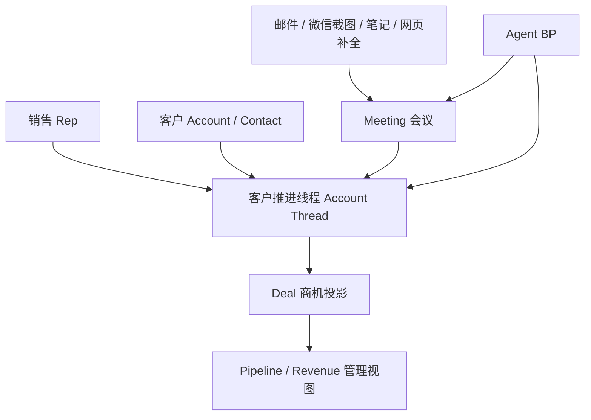
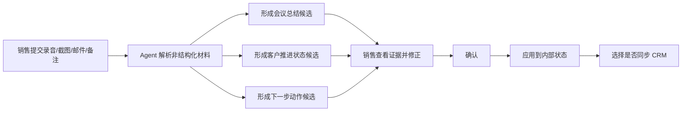
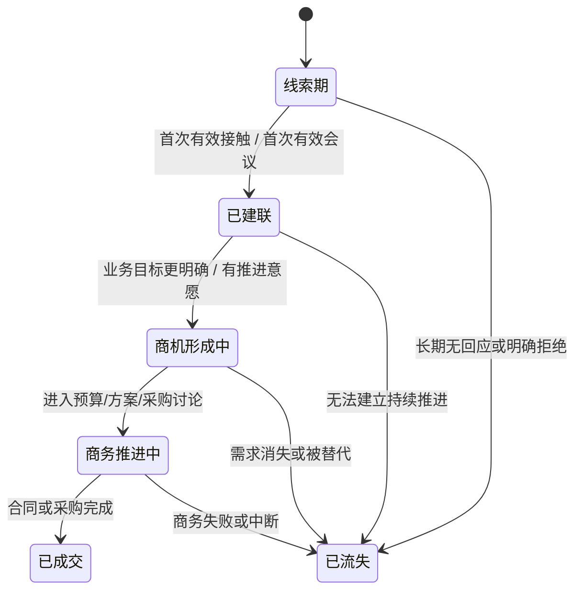
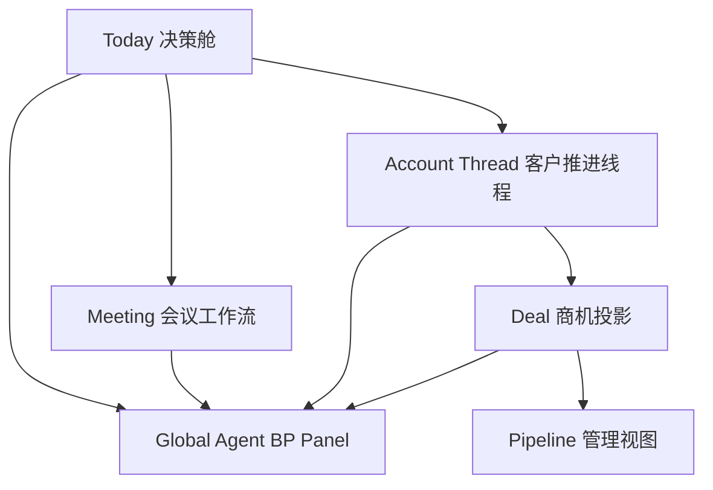
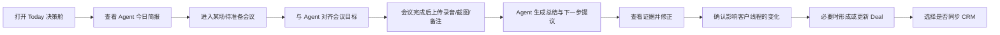
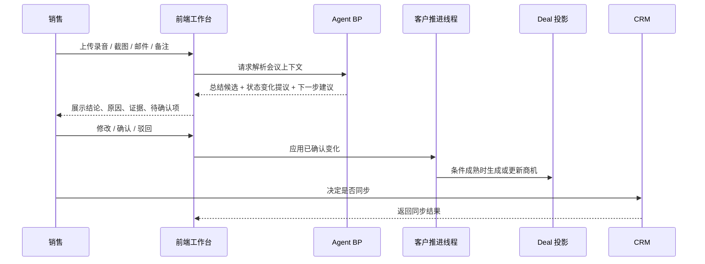

> Status: archived
> Archived because: 这是一份阶段性文档快照，当前 canonical 方向与实现基线已经收敛到 `docs/current/*`。
> Superseded by: `docs/current/README.md`, `docs/current/product-direction.md`, `docs/current/implementation-status.md`
>
> 仅保留作历史上下文与复盘材料使用，不再作为当前实现依据。

# Meeting-First Agent BP 产品阶段方案

## 1. 这份方案要回答什么

这不是开发计划，也不是接口设计稿。

这份方案只回答四个产品阶段问题：

1. 我们到底把什么当成系统里的第一主对象
2. 一线销售每天面对的工作台，应该围绕什么来组织
3. Agent 在产品里到底扮演什么角色
4. 前端页面和交互流，应该如何承载这套逻辑

一句话定义：

**这不是一个让销售维护商机表单的系统，而是一个围绕线下会议推进客户成交的 Agent 决策工作台。**

---

## 2. 核心产品立场

本产品的核心不是 CRM 录入，也不是聊天机器人。

它的定位更像：

**一个销售的 AI Business Partner。**

它会像一个懂业务的销售 BP 一样工作：

- 主动告诉销售今天最重要的事
- 解释为什么这件事重要
- 告诉销售下一步该怎么推进
- 帮销售把非结构化材料转成可执行判断
- 在关键节点要求销售确认
- 必要时给销售派任务，而不是等销售来提问

因此，产品的前台主叙事不应该是：

- 一排排字段
- 一张张表单
- 一页页 CRM 卡片

而应该是：

- 当前最重要的客户推进事项
- 最近一次会议带来了什么变化
- 这条推进为什么卡住了
- 下一步应该由谁在什么时候做什么

---

## 3. 产品世界观

### 3.1 两个对象，一个核心事件

围绕线下会议，系统里一定同时存在两个真实角色：

- 销售
- 客户

会议不是孤立发生的。

每一场会议，本质上都是：

**销售为了推动客户进展，而与客户发生的一次高密度互动。**

因此，这个产品的最小真实单元不是 Deal，也不是客户档案，而是：

**销售与客户围绕一次次 Meeting 发生的推进关系。**

### 3.2 Meeting 是主对象，但不是唯一对象

Meeting 是最重要的对象，因为它承载了最高密度、最高价值、最接近真实判断的信息。

但 Meeting 不能孤立存在。它必须挂在一条持续推进线程上。

这条线程可以理解为：

**客户推进线程 Account Thread**

它表示：

- 当前是哪个销售在推进这家客户
- 这家客户现在处于什么客观进展状态
- 最近一次会议改变了什么
- 下一步动作是什么
- 是否已经进入正式商机阶段

### 3.3 Deal 不是源头对象，而是投影对象

在传统 CRM 里，Deal 往往是最重要的对象。

但在这个产品里，不应该这样。

原因很简单：

- 线索期还没有正式商机
- 建联期也不一定形成正式商机
- 很多真实推进动作发生在 Deal 之前
- 如果过早把一切都塞进 Deal，产品会退回 CRM 思维

因此更合理的关系应该是：

**Meeting 驱动客户推进线程，客户推进线程在条件成熟时再投影为 Deal。**

可以概括为：

**Meeting-first, Thread-backed, Deal-projected**

---

## 4. 核心语义模型

### 4.1 四层关系



这张图表达的是：

1. 销售和客户共同组成了一条推进线程
2. 会议是线程里最关键的事件
3. 非结构化材料先进入会议上下文
4. Agent 基于会议和上下文做判断
5. 只有当条件成熟，线程才投影为 Deal
6. Deal 再汇总成 Pipeline 和 Revenue

### 4.2 应该被前端重点呈现的，不是“字段”，而是两种状态

这套产品里最重要的不是把更多字段摆出来，而是把两种状态讲清楚：

1. 客户进展的客观状态
2. 销售当前的执行状态

### 4.3 客户进展的客观状态

这是销售和管理层都关心的“事实层”。

建议用用户能直观看懂的表达：

- 线索期
- 已建联
- 商机形成中
- 商务推进中
- 已成交
- 已流失

这层状态回答的是：

- 这家客户目前走到哪一步了
- 它是否真的在往成交靠近
- 它是不是已经具备正式商机条件

### 4.4 销售当前的执行状态

这是一线销售工作台最重要的一层。

建议展示为：

- 待准备
- 已约会
- 会后待确认
- 待确认下一步
- 等待客户反馈
- 等待内部支持
- 阻塞中
- 已停滞

这层状态回答的是：

- 我今天到底要做什么
- 这条客户线程为什么没有继续往前走
- 我应该主动推进，还是等待别人动作

### 4.5 一个线程，两行状态

每一条客户推进线程，都应该在前端同时展示两行信息：

- `客户进展`：这家客户现在客观上走到哪一步
- `当前动作`：销售今天必须推进什么

例如：

- 客户进展：已建联，正在判断是否形成正式商机
- 当前动作：今天内确认下次会议时间，并补齐预算负责人信息

这比只给一个 Stage 标签更有产品价值。

---

## 5. Agent 的产品角色

### 5.1 Agent 不是聊天框

在这个产品里，Agent 不应该被理解成“一个可以问问题的 AI”。

它更像一位真实存在的销售 BP。

它的职责包括：

- 读取会议与上下文
- 形成结构化判断
- 用自然语言向销售汇报
- 给出优先级
- 解释理由和证据
- 形成任务
- 要求关键确认
- 将确认后的结果推进到系统内部状态

### 5.2 Agent 的典型表达方式

好的表达应该像这样：

- 这位客户已经从线索进入有效建联阶段，但还不足以判断为正式商机。
- 最近这次会议让推进前进了一步，因为客户首次明确了业务目标，也接受了下一次深入讨论。
- 今天最重要的动作不是报价，而是锁定下一场带日期的会议，并确认预算责任人。

不好的表达方式：

- 风险评分提升 12 分。
- 该客户处于多维特征推理后的高潜状态。

### 5.3 Agent 需要输出什么

Agent 的输出不是一段抽象结论，而应该是一组可执行结果：

- 结论
- 原因
- 证据
- 当前优先级
- 建议动作
- 待确认项
- 是否影响 Deal
- 是否建议同步 CRM

---

## 6. 输入设计：用户只负责提供材料，不负责结构化

### 6.1 输入原则

产品要尽量薄。

不是系统不需要结构化，而是：

**不要把结构化工作交给销售。**

销售只需要提供最接近现场的原始材料，Agent 负责把它们转成结构化状态。

### 6.2 用户端最轻输入

建议只保留这些高价值输入：

- 会议录音
- 微信截图
- 邮件正文
- 会前一句话目标
- 会后一句话判断
- 销售的语音备注或短文本备注

这些输入都属于“低门槛、非结构化、贴近真实工作流”的材料。

### 6.3 系统自动补全输入

系统和 Agent 自动补充：

- 客户公开信息
- 历史会议摘要
- 历史沟通摘要
- CRM 已有信息
- 日历与约会信息
- 数据缺失和同步状态

### 6.4 输入到结构化判断的转换链路



这条链路的核心意义是：

- 销售只提供原始材料
- Agent 负责解释和归纳
- 关键节点由人确认
- 同步永远是最后一步

---

## 7. 生命周期流转：慢状态与快状态

### 7.1 为什么不能只用一个状态字段

如果把客户进展、销售动作、会议结果、商机判断都压进一个 Stage 字段，系统会很快变得难懂。

因此，产品上应该明确区分：

- 慢变化的客观生命周期
- 快变化的执行推进状态

### 7.2 客观生命周期

这是较慢变化的一层，通常不会因为一句聊天内容就跳变。



### 7.3 执行推进状态

这是变化更快的一层，也是销售每天最该看的状态。

一个客户线程可能生命周期不变，但执行状态快速波动，例如：

- 昨天还是已建联
- 今天开完会后仍然是已建联
- 但执行状态已经从“等待客户”变成“待确认下一步”

这层状态决定的不是“客户属于哪一类”，而是“销售今天该干什么”。

### 7.4 Meeting 如何影响状态

Meeting 不应该直接把状态自动改掉。

Meeting 更适合成为一个“状态变化提议器”。

也就是说：

1. 会议结束后，Agent 先提出状态变化建议
2. 销售查看证据和摘要
3. 销售修正或驳回
4. 销售确认后，系统再应用到线程和 Deal

这能保证系统仍然是 Agent-first，但不会变成黑箱自动化。

---

## 8. 前端信息架构

## 8.1 IA 原则

前端信息架构不应该从“模块”出发，而应该从“销售一天怎么工作”出发。

因此 IA 的核心不是把菜单排全，而是让用户在任何时候都回答四个问题：

1. 今天最重要的事情是什么
2. 这件事为什么重要
3. 我要做的下一步是什么
4. 我能不能立刻执行或继续追问

## 8.2 一线销售视角下的页面心智模型

建议把一线销售视角的产品结构理解为五层：



这张图表达的是：

- 一线销售的入口是 Today 决策舱，不是 Deal 列表
- Meeting 是最核心的生产页面
- 客户推进线程是持续上下文
- Deal 是正式商机视图
- Agent BP 是贯穿所有页面的主叙事层

## 8.3 推荐的前端模块结构

### L1：Today 决策舱

这是销售每天打开系统看到的第一页。

它首先展示：

- 今天最重要的 3 件事
- 今天的会议准备与会后待确认
- 哪些客户推进已经卡住
- 哪些动作今天必须拍板

### L2：Meeting 工作流

这是最核心的生产模块。

它承接：

- 会前准备
- 会中信息回流
- 会后总结与确认
- 下一步动作生成

### L3：Account Thread 客户推进线程

这不是传统意义上的客户详情页。

它应该展示：

- 这家客户目前的客观推进状态
- 最近几次会议带来的变化
- 当前推进阻点
- 下一步推进路径
- 是否已形成正式商机

### L4：Deal 商机投影

Deal 页不是一线销售的起点，而是正式商机视图。

它用于承接：

- 已明确的商业机会
- 需要进入 Pipeline 和 Forecast 的对象
- 对主管和管理层可见的标准化商机语义

### L5：Pipeline / Revenue 管理视图

这是主管和 CEO 的工作面。

它不应该承载一线销售最细的日常推进动作，而应该承载：

- 商机风险
- 漏斗变化
- 团队推进质量
- 预测置信度

---

## 9. 一线销售工作台应该长什么样

### 9.1 首页不是总览，而是任务驾驶舱

首页的首要任务不是让销售看自己的全部客户，而是让销售马上知道：

- 今天先处理哪一场会议
- 哪条客户线程需要跟进
- 哪些总结还没确认
- 哪些建议已经可以应用

### 9.2 首页建议布局

```text
+----------------------------------------------------------------------------------+
| 顶部：Agent BP 今日简报                                                           |
| 你今天先做这 3 件事 + 为什么                                                     |
+--------------------------------------+-------------------------------------------+
| 今日会议流                            | 待确认区                                  |
| - 待准备会议                          | - 会后总结待确认                          |
| - 今日已完成会议                      | - 下一步动作待确认                        |
| - 待生成会后动作                      | - 待应用 / 待同步                         |
+--------------------------------------+-------------------------------------------+
| 客户推进线程列表                                                                   |
| 每条线程显示：客户进展 + 当前动作 + 最近会议变化 + 阻点 + 下一步                 |
+----------------------------------------------------------------------------------+
| Agent 全局侧边面板：可追问、可解释、可确认、可派生动作                           |
+----------------------------------------------------------------------------------+
```

### 9.3 首页上最重要的不是 KPI，而是优先级

对一线销售来说，首页优先级应该是：

1. Agent 今日判断
2. 今天的会议与会后任务
3. 客户线程的推进状态
4. 已形成商机的正式视图

KPI 可以有，但不能喧宾夺主。

---

## 10. Meeting 页面应该成为最核心生产页面

### 10.1 Meeting 页面不只是看纪要

Meeting 页面是整套系统的主生产页面。

它应该承载四件事：

1. 会前准备
2. 会中证据回放
3. 会后总结修正
4. 下一步推进确认

### 10.2 Meeting 页面推荐结构

```text
+----------------------------------------------------------------------------------+
| 会议头部：客户 / 销售 / 时间 / 当前线程状态 / 数据状态                            |
+-----------------------------+--------------------------------+-------------------+
| 会前准备                    | 会议证据                       | Agent BP 面板     |
| - 客户背景                  | - 录音/转录                    | - 结论            |
| - 历史摘要                  | - 微信截图                      | - 原因            |
| - 会议目标                  | - 邮件片段                      | - 风险            |
| - 建议提问                  | - 高亮片段                      | - 建议动作        |
+-----------------------------+--------------------------------+-------------------+
| 会后总结与状态提议                                                               |
| - 总结候选                                                                         |
| - 客户进展变化提议                                                                 |
| - 下一步动作提议                                                                   |
| - 是否形成正式商机                                                                  |
| - 确认 / 修改 / 驳回 / 重新生成                                                     |
+----------------------------------------------------------------------------------+
| 影响范围：客户线程 | Deal 投影 | 是否同步 CRM                                     |
+----------------------------------------------------------------------------------+
```

### 10.3 Meeting 页面最关键的产品价值

这个页面必须清晰回答：

- 这次会议到底带来了什么真实变化
- 这些变化基于哪些证据
- 哪些变化还只是 Agent 建议
- 哪些变化已经被人工确认
- 这些变化是否应该进一步影响 Deal 或 CRM

---

## 11. Account Thread 页面应该是什么

### 11.1 它不是普通客户详情页

传统客户详情页通常展示客户信息、联系人、历史记录。

但这个产品里更重要的是：

**这家客户目前正在被如何推进。**

因此 Account Thread 页面更像“客户推进作战页”。

### 11.2 它应该展示什么

- 客户当前进展状态
- 当前谁在推进
- 最近一次会议带来了什么变化
- 当前阻点是什么
- 下一次会议或推进动作是什么
- 如果已经形成正式商机，当前 Deal 是什么状态

### 11.3 它应该如何说话

它不应该说：

- 客户等级 A
- 标签 8 个
- 表单字段若干

它应该说：

- 这家客户已经从线索进入有效建联，但还未形成足够明确的商机
- 最近一次会议让推进往前走了一步，因为客户首次明确了目标和参与人
- 当前最大阻点是预算责任人仍未明确

---

## 12. Deal 页的重新定位

Deal 在这个体系里仍然重要，但它的定位需要收敛。

它不再是销售的第一工作面，而是：

- 正式商机的标准化视图
- 对主管和管理层可读的业务对象
- Pipeline 和 Forecast 的基础单元

因此 Deal 页面应该重点回答：

- 这条商机为什么成立
- 最近哪些会议支撑了这条商机
- 当前风险是什么
- 下一步应该推进什么
- 哪些内容已经被人工确认

---

## 13. 全局 Agent 面板的定位

### 13.1 全局 Agent 是 BP，不是搜索框

Agent 面板应该在任何页面都可用，但它不能只是一个空白输入框。

它默认应该带着上下文说话。

例如：

- 在 Today 页，它应该告诉你今天先做什么
- 在 Meeting 页，它应该告诉你这次会议改变了什么
- 在 Account Thread 页，它应该告诉你这家客户为什么卡住
- 在 Deal 页，它应该告诉你为什么这条商机值得推进或需要降级

### 13.2 全局 Agent 面板结构

```text
+--------------------------------------------------+
| Agent BP Header                                  |
| 当前上下文：Today / Meeting / Thread / Deal      |
+--------------------------------------------------+
| Agent 结论                                        |
| 为什么重要                                        |
| 关键证据                                          |
+--------------------------------------------------+
| 待确认项                                          |
| [确认] [修改] [驳回] [重跑]                       |
+--------------------------------------------------+
| 可执行动作                                        |
| [生成跟进] [生成下次会议 Brief] [应用] [同步]     |
+--------------------------------------------------+
| 继续追问                                          |
+--------------------------------------------------+
```

这个面板首先是一个“带判断的工作协作面板”，然后才是一个对话入口。

---

## 14. 关键交互流

## 14.1 一线销售日常流



## 14.2 会议驱动的闭环



## 14.3 前端最重要的不是“提交成功”，而是“状态变化被看见”

每次关键交互后，用户应该明确看到：

- 哪个判断只是建议
- 哪个判断已经确认
- 哪个判断已经应用到内部状态
- 哪个判断已经同步到外部系统

因此所有关键卡片都应显式区分：

- 建议
- 已确认
- 已应用
- 已同步

---

## 15. 这套方案和传统 CRM 的根本区别

传统 CRM 的核心问题是：

- 让销售手工维护状态
- 让销售自己从杂乱信息里归纳进展
- 让页面先展示表单，再展示结果

这套方案的核心差异是：

- 以 Meeting 为主对象
- 以 Agent BP 为主交互角色
- 以非结构化输入为起点
- 以客户推进线程为持续上下文
- 以 Deal 作为正式投影对象
- 以确认和证据链保证可信度

所以，它不是“CRM + 一个聊天框”。

它更像：

**一个围绕会议推进成交的销售决策舱。**

---

## 16. 本阶段建议先统一的产品结论

建议先在产品阶段固定以下 8 条原则：

1. `Meeting` 是第一主对象
2. `Agent` 是销售 BP，不是纯问答机器人
3. 用户输入尽量保持非结构化
4. 结构化判断由 Agent 负责生成
5. 销售只确认关键节点，不承担重录入工作
6. `Account Thread` 是持续推进容器
7. `Deal` 是线程成熟后的正式投影对象
8. `Pipeline / Revenue` 只承接 Deal 层，不反向定义销售日常工作面

如果这 8 条成立，后续前端、状态模型和真实数据接入才会稳定。
