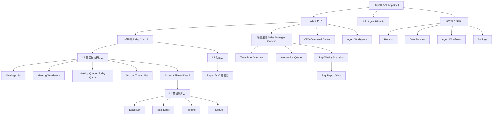
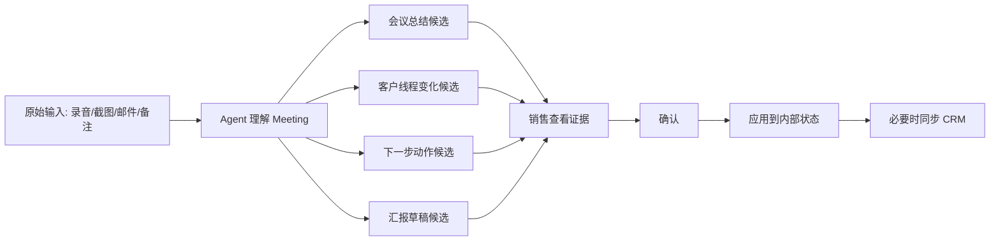
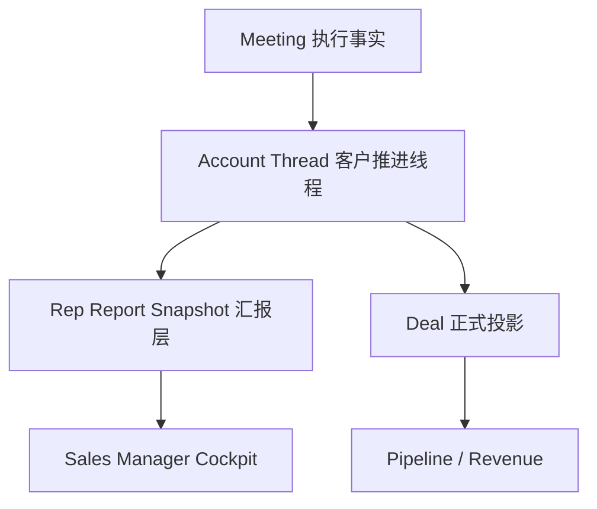
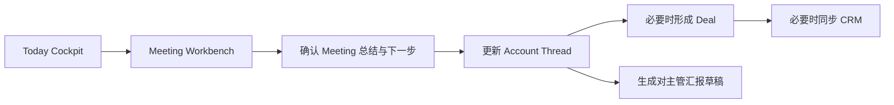
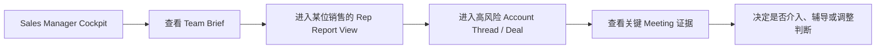
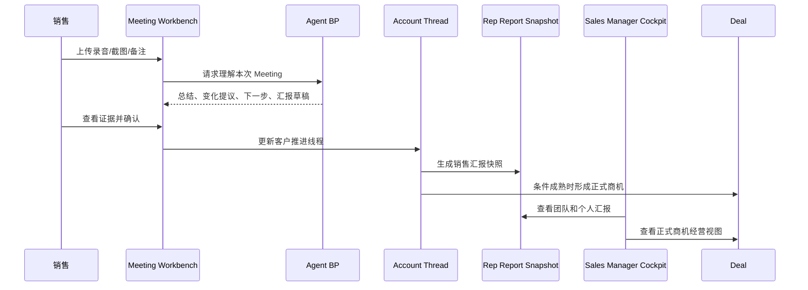

# Meeting-First Agent BP 最终版产品设计

## 1. 文档目的

这是一份产品阶段的最终版设计说明。

它不解决实现细节，不写接口，不写前端技术方案。

它只解决这几个最终需要统一的问题：

1. 这个产品的第一主对象到底是什么
2. 一线销售、销售主管、CEO 分别应该看到什么
3. 页面层级应该怎么组织，才能让系统既是 Agent-first，又不是 CRM-first
4. 最关键的四个核心页面应该如何承载业务
5. 销售推进、主管汇报、商机投影三层关系应该如何连接

一句话结论：

**这是一个以 Meeting 为源头、以 Agent BP 为主叙事、以客户推进线程为持续上下文、以 Deal 为正式业务投影的销售决策系统。**

---

## 2. 产品总定义

### 2.1 系统定位

这个产品不是一个传统 CRM，也不是一个聊天产品。

它更像一个：

**围绕线下会议推进成交的销售操作系统。**

其中 Agent 扮演的不是工具，而是一个持续在线的销售 Business Partner。

它需要帮助销售完成三种工作：

1. 对外推进客户
2. 对内整理进展
3. 向上完成汇报

因此，这个系统的产品核心不是“把数据录进去”，而是“把推进过程讲清楚，并把下一步行动组织出来”。

### 2.2 三条并行的产品主线

整套系统实际上有三条同时存在的主线：

1. `执行主线`
   会议、会前准备、会后总结、下一步动作、持续推进

2. `汇报主线`
   销售如何把本周推进结果汇总给主管，主管如何看懂团队进展

3. `经营主线`
   哪些客户已经形成正式商机，这些商机如何进入 Pipeline 和 Revenue

这三条主线不能混在一起，但必须从同一份真实事实中派生出来。

---

## 3. 产品世界观

## 3.1 两个角色，一个核心事件

围绕 Meeting，一定同时存在两个对象：

- 销售 Rep
- 客户 Account / Contact

Meeting 是这两个角色之间发生的高密度互动事件。

因此，系统的最小真实事件是：

**销售与客户的一次 Meeting。**

这也是整个系统里信息价值最高、判断价值最高的起点。

## 3.2 Meeting 是源头对象

Meeting 必须被定义为源头对象，而不是附属记录。

原因是：

- 它是客户真实意图最密集的来源
- 它是销售推进是否有效的核心证据
- 它天然能串起会前、会中、会后三个阶段
- 它能推动客户状态变化、任务生成和商机判断

因此，Meeting 不只是“会议详情页的一条记录”，而是整个产品运转的起点。

## 3.3 客户推进线程是持续上下文

Meeting 虽然是源头，但它不是孤立存在的。

Meeting 必须挂在一条持续的客户推进线程上。

这里建议统一命名为：

**Account Thread**

它表达的是：

- 哪个销售正在推进这家客户
- 这家客户当前处于什么阶段
- 最近一次会议带来了什么变化
- 当前阻点是什么
- 下一步要做什么
- 是否已经形成正式商机

## 3.4 Deal 是正式投影对象

Deal 不是整个过程的源头，而是一个正式投影对象。

它应该只在这类条件成熟时出现：

- 客户目标更清晰
- 推进关系已经持续发生
- 出现了明确的商业机会或预算讨论
- 需要进入 Pipeline 管理口径

因此，Deal 的定位是：

- 正式业务视图
- 管理层可消费的标准对象
- Pipeline / Revenue 的基础单元

而不是销售每天最先打开的工作对象。

---

## 4. 总体信息架构

## 4.1 产品层级图



## 4.2 各层职责

### L0 应用外壳

承担：

- 左侧导航
- 顶部上下文栏
- 全局 Agent BP 面板
- 数据状态入口

这是固定框架，不承载具体业务判断。

### L1 角色入口层

承担：

- 一线销售入口
- 销售主管入口
- CEO 入口
- 通用 Agent 入口

它定义“用户今天从哪里开始工作”。

### L2 会议驱动执行层

承担：

- 会前准备
- 会议证据查看
- 会后总结
- 下一步动作
- 客户推进线程推进

这是最贴近一线销售真实工作的层。

### L3 汇报层

承担：

- 销售对主管的汇报草稿
- 主管对团队推进的汇总视图
- 主管介入优先级判断

这是这轮补上的关键一层。

### L4 商机投影层

承担：

- 正式商机对象
- Pipeline 管理视图
- Revenue 管理视图

它是执行事实的经营投影层。

### L5 支撑与透明层

承担：

- 数据透明度
- 辅导与复盘
- Agent 过程可见性
- 设置

---

## 5. 核心对象与语义

## 5.1 四个关键对象

整个产品最重要的四个对象是：

1. `Meeting`
2. `Account Thread`
3. `Deal`
4. `Rep Report Snapshot`

## 5.2 四个对象的职责划分

### `Meeting`

是信息源头。

它负责回答：

- 这次客户互动里到底发生了什么
- 客户表达了什么真实意图
- 销售做对了什么、漏掉了什么
- 这次 Meeting 是否改变了推进判断

### `Account Thread`

是持续上下文。

它负责回答：

- 这家客户现在推进到哪了
- 这条线程当前卡在哪
- 最近哪次 Meeting 带来了变化
- 接下来最该做什么

### `Deal`

是正式投影。

它负责回答：

- 哪些推进已经足以形成正式商机
- 当前商机为什么值得推进或降级
- 它处于哪个经营阶段
- 它对 Pipeline 和 Revenue 的贡献是什么

### `Rep Report Snapshot`

是汇报层对象。

它负责回答：

- 这位销售在某个时间窗口内推进了什么
- 聊了多少客户、形成了多少有效机会
- 哪些客户前进了，哪些停住了
- 哪些事情需要主管介入

## 5.3 两层状态模型

整个产品里最重要的状态，不是一个单一 Stage，而是两层状态：

### 第一层：客户进展的客观状态

这层状态是事实层，用来说明客户推进到哪里。

建议使用用户易懂的表达：

- 线索期
- 已建联
- 商机形成中
- 商务推进中
- 已成交
- 已流失

### 第二层：销售当前的执行状态

这层状态是动作层，用来说明销售现在要做什么。

建议使用：

- 待准备
- 已约会
- 会后待确认
- 待确认下一步
- 等待客户反馈
- 等待内部支持
- 阻塞中
- 已停滞

## 5.4 一个线程，两行状态

每一条客户推进线程在页面上都应该同时显示两行语义：

- `客户进展`
- `当前动作`

例如：

- 客户进展：商机形成中，正在进入方案讨论
- 当前动作：本周内确认下一次线下会议，并补齐预算责任人

这比传统 CRM 的单阶段标签更接近真实业务。

---

## 6. Agent BP 的角色定义

## 6.1 Agent 在系统中的位置

Agent 不是聊天入口，而是产品的主叙事者。

它在整个系统中的职责是：

- 读 Meeting
- 读客户线程
- 提炼问题
- 给出优先级
- 输出自然语言判断
- 展示理由和证据
- 形成下一步动作
- 形成汇报草稿
- 在关键节点要求确认

## 6.2 Agent 的输出层级

Agent 在不同页面上的输出重点不同：

- 在 `Today Cockpit`：告诉销售今天先做什么
- 在 `Meeting Workbench`：告诉销售这次 Meeting 改变了什么
- 在 `Account Thread Detail`：告诉销售这家客户为什么卡住或推进
- 在 `Sales Manager Cockpit`：告诉主管团队里哪几个点需要介入
- 在 `Deal Detail`：告诉主管或销售这条商机为什么值得推进或需要降级

## 6.3 Agent 的表达方式

Agent 的表达应该像一个专业销售同事，而不是系统 debug 面板。

好的表达：

- 这位客户本周已经从单次接触变成了稳定推进对象，但还不足以判断为正式商机。
- 本周你最该处理的是两场会后的下一步确认，否则三个客户线程都会进入等待状态。
- 这位销售本周触达不少，但真正形成有效机会的主要只有两个客户，主管应优先看这两条的预算问题。

不好的表达：

- 风险评分提升。
- 多维推理状态变更。
- 当前对象进入高潜阶段。

---

## 7. 输入与事实来源

## 7.1 输入原则

用户负责提供材料，Agent 负责理解材料。

系统不应该要求销售先做复杂结构化录入。

## 7.2 用户侧轻输入

建议保留这些高价值输入：

- 会议录音
- 微信截图
- 邮件正文
- 会前一句话目标
- 会后一句话判断
- 销售的语音备注或短文本备注

## 7.3 系统自动补充

系统自动补充：

- 客户公开信息
- 历史会议摘要
- 历史沟通摘要
- CRM 已有状态
- 数据覆盖率和新鲜度
- 缺失数据告警

## 7.4 输入到产出的逻辑



---

## 8. 四个核心页面的最终设计

## 8.1 页面一：一线销售 Today Cockpit

### 页面定位

这是销售每天进入系统的第一屏。

它不是传统 dashboard，也不是客户列表。

它应该是：

**销售今天的 Agent 决策驾驶舱。**

### 页面需要回答的问题

1. 今天最重要的事情是什么
2. 为什么这些事情重要
3. 哪些 Meeting 要准备
4. 哪些会后结果还没确认
5. 哪些客户线程正在卡住
6. 哪些内容要汇报给主管

### 页面结构

```text
+----------------------------------------------------------------------------------+
| 顶部：Agent BP 今日简报                                                           |
| 你今天先做这 3 件事 + 为什么                                                     |
+--------------------------------------+-------------------------------------------+
| 今日会议流                            | 待确认区                                  |
| - 待准备会议                          | - 会后总结待确认                          |
| - 今日已完成会议                      | - 下一步动作待确认                        |
| - 待生成会后动作                      | - 待应用 / 待同步                         |
+--------------------------------------+-------------------------------------------+
| 客户推进线程列表                                                                   |
| 每条线程：客户进展 + 当前动作 + 最近变化 + 阻点 + 下一步                         |
+--------------------------------------+-------------------------------------------+
| 对主管汇报草稿                        | Agent 全局面板                            |
| - 今日摘要                            | - 继续追问                                |
| - 本周摘要                            | - 查看证据                                |
| - 一键编辑                            | - 生成跟进                                |
+----------------------------------------------------------------------------------+
```

### 页面上的 Agent 角色

在这个页面，Agent 不只是总结，而是像一个主动分配优先级的 BP：

- 先做哪三件事
- 哪两条客户线程需要今天推进
- 哪个会后总结必须先确认
- 哪个内容应该整理成向主管汇报的材料

### 页面上最重要的区块优先级

1. Agent 今日简报
2. 今日会议流
3. 待确认区
4. 客户推进线程列表
5. 对主管汇报草稿

### 页面跳转关系

- 点击今日会议 -> 进入 `Meeting Workbench`
- 点击客户线程 -> 进入 `Account Thread Detail`
- 点击待确认的正式商机 -> 进入 `Deal Detail`
- 点击汇报草稿 -> 打开汇报编辑视图或销售个人汇报页

---

## 8.2 页面二：Meeting Workbench

### 页面定位

这是整套系统最核心的生产页面。

它不是“会议记录页”，而是：

**从一次 Meeting 中提炼判断、任务和状态变化的工作台。**

### 页面需要回答的问题

1. 这次 Meeting 前，我知道什么
2. 这次 Meeting 里到底发生了什么
3. 这次 Meeting 让客户推进发生了什么变化
4. 哪些变化只是 Agent 建议，哪些已经确认
5. 它是否应该影响客户线程、Deal 或 CRM

### 页面结构

```text
+----------------------------------------------------------------------------------+
| 头部：客户 / 销售 / 时间 / 当前线程状态 / 数据状态                                |
+-----------------------------+--------------------------------+-------------------+
| 会前准备                    | 会议证据                       | Agent BP 判断      |
| - 客户背景                  | - 录音/转录                    | - 这次 Meeting      |
| - 历史摘要                  | - 微信截图                      |   改变了什么        |
| - 会议目标                  | - 邮件片段                      | - 为什么重要        |
| - 建议提问                  | - 高亮片段                      | - 最该做什么        |
+-----------------------------+--------------------------------+-------------------+
| 会后总结与状态提议                                                               |
| - 总结候选                                                                         |
| - 客户进展变化提议                                                                 |
| - 下一步动作提议                                                                   |
| - 是否形成正式商机                                                                  |
| - 确认 / 修改 / 驳回 / 重新生成                                                     |
+----------------------------------------------------------------------------------+
| 影响范围：客户线程 | Deal 投影 | 是否同步 CRM                                     |
+----------------------------------------------------------------------------------+
```

### 页面上的 Agent 角色

在这个页面，Agent 更像会后复盘和推进顾问：

- 它先说结论
- 再给依据
- 再给下一步
- 最后要求人确认

### 页面最关键的交互闭环

```text
Meeting 完成
-> Agent 生成总结和状态变化提议
-> 销售查看证据
-> 销售修正要点
-> 销售确认对客户线程的影响
-> 必要时更新 Deal
-> 最后选择是否同步 CRM
```

### 页面最关键的价值

这是把“非结构化事实”变成“系统内可执行状态”的地方。

---

## 8.3 页面三：Account Thread Detail

### 页面定位

这不是传统客户详情页。

它应该是：

**一条客户推进线程的作战页。**

### 页面需要回答的问题

1. 这家客户目前客观推进到哪一步
2. 最近哪次 Meeting 让这条线程发生变化
3. 当前最大阻点是什么
4. 这条线程是否已经形成正式商机
5. 现在最该推进的动作是什么

### 页面结构

```text
+----------------------------------------------------------------------------------+
| 头部：客户名称 / 当前客户进展 / 当前动作 / Owner / 数据状态                       |
+-----------------------------+--------------------------------+-------------------+
| 线程概览                    | 最近变化                       | Agent BP 建议      |
| - 当前进展                  | - 最近 3 次 Meeting            | - 当前最大风险      |
| - 当前动作                  | - 每次带来的变化               | - 下一步动作        |
| - 阻点                      | - 证据摘录                     | - 是否该升格为 Deal |
+-----------------------------+--------------------------------+-------------------+
| 推进时间线                                                                        |
| - 会议节点                                                                         |
| - 沟通节点                                                                         |
| - 状态变化节点                                                                     |
+----------------------------------------------------------------------------------+
| 正式商机投影区                                                                     |
| - 已形成的 Deal / 尚未形成 Deal                                                    |
| - 当前 Deal 的关系                                                                 |
+----------------------------------------------------------------------------------+
```

### 页面上的 Agent 角色

在这个页面，Agent 的职责不是解释单次 Meeting，而是解释连续推进：

- 为什么这条线程在前进
- 为什么它停住了
- 为什么现在应该升格为 Deal 或暂时不要
- 为什么今天要优先推进这件事

### 页面最重要的产品价值

它把“客户档案”变成“推进上下文”。

销售在这里看到的不是静态资料，而是一条动态推进轨迹。

---

## 8.4 页面四：Sales Manager Cockpit + Team Brief

### 页面定位

这是主管真正的第一工作面。

它不是纯 Dashboard，也不是简单团队列表。

它应该是：

**围绕团队推进结果、风险和介入点的管理简报台。**

### 页面需要回答的问题

1. 本周团队推进总体怎么样
2. 多少客户被触达，多少真正形成了有效机会
3. 哪些商机在前进，哪些在停滞
4. 哪些销售需要辅导，哪些客户需要我介入
5. 团队汇报应该如何快速看懂，而不是逐个看 Meeting

### 页面结构

```text
+----------------------------------------------------------------------------------+
| 顶部：Agent 主管简报                                                               |
| 本周团队最重要的变化 + 3 个主管建议动作                                           |
+--------------------------------------+-------------------------------------------+
| Team Brief Overview                  | Intervention Queue                        |
| - 本周触达客户数                     | - 需要主管介入的客户线程                  |
| - 本周完成会议数                     | - 需要主管介入的 Deal                     |
| - 新形成商机数                       | - 需要主管介入的销售                      |
| - 推进中的商机数                     |                                           |
| - 停滞客户数                         |                                           |
+--------------------------------------+-------------------------------------------+
| Rep Weekly Snapshot 卡片列表                                                         |
| 每位销售：本周推进摘要 + 新机会 + 风险 + 是否需要辅导                             |
+----------------------------------------------------------------------------------+
| Drilldown：高风险商机 / 团队趋势 / Pipeline 入口                                  |
+----------------------------------------------------------------------------------+
```

### 页面上的 Agent 角色

在这个页面，Agent 更像主管身边的 Chief of Staff：

- 先总结本周团队变化
- 再指出最值得介入的 3 个点
- 再给主管一个简短可执行的介入建议

### 主管首页最重要的新增层：Team Brief Overview

这是本轮最关键的新增语义。

它不应该只是一个图表区，而应该是一块专门承接“销售汇报层”的模块。

它需要把销售的执行事实汇总成主管可读的简报。

例如：

- 本周团队共推进 20 个客户，其中 6 个进入有效建联，3 个形成正式商机，2 个出现停滞。
- 最值得你介入的是 A 客户的预算确认、B 客户的决策链路，以及 C 销售本周连续两场会后的下一步确认质量。

### Rep Weekly Snapshot 应该看什么

每个销售卡片不该只是 activity count。

而应该包括：

- 本周触达客户数
- 本周完成 Meeting 数
- 新形成商机数
- 推进中的重点客户数
- 停滞客户数
- 当前最需要主管帮助的 1 件事

### 页面跳转关系

- 点击某个销售 -> 进入 `Rep Report View`
- 点击某个高风险客户线程 -> 进入 `Account Thread Detail`
- 点击某个正式商机 -> 进入 `Deal Detail`
- 点击团队漏斗或趋势 -> 进入 `Pipeline`

---

## 9. 汇报层的最终定义

## 9.1 为什么必须单独定义汇报层

如果没有汇报层，系统就会出现两个问题：

1. 销售需要自己把底层事实重新整理成一版给主管看
2. 主管只能从一堆 Meeting 和 Deal 里自己拼出团队图景

这都会让系统退回传统 CRM 的低效模式。

因此，必须有一个明确的派生层，把执行事实转成管理可读内容。

## 9.2 汇报层的三个出口

### 出口一：销售端的 Report Draft

位置：`Today Cockpit`

作用：

- Agent 自动生成“今日汇报草稿”或“本周汇报草稿”
- 销售只做少量修订，不需要重写

### 出口二：主管端的 Team Brief Overview

位置：`Sales Manager Cockpit`

作用：

- 把所有销售的推进事实汇总成团队层的管理简报
- 先讲结论，再给主管看结构化摘要

### 出口三：销售个人页的 Rep Report View

位置：`Rep Report View`

作用：

- 主管下钻到某个销售，查看其本周推进全貌
- 不是看流水账，而是看“结果、变化、风险、需要帮助的地方”

## 9.3 汇报层应该如何组织内容

汇报层不应该只围绕“聊了几个客户”组织。

它应该围绕这四个主管最关心的问题组织：

1. 有没有形成新的有效机会
2. 现有机会有没有前进
3. 哪些客户或商机卡住了
4. 我是否需要介入

## 9.4 汇报层的推荐表达

第一层是自然语言简报：

- 本周王磊推进了 5 个客户，其中 2 个客户从线索进入有效建联，1 个形成正式商机，另有 1 个线程连续两周停滞，建议你介入预算确认。

第二层是极简结构化摘要：

- 触达客户数
- 完成 Meeting 数
- 新形成商机数
- 推进中的商机数
- 停滞客户数
- 需主管介入数

第三层才是重点对象列表：

- 客户
- 当前进展
- 本周变化
- 是否形成商机
- 风险
- 下一步
- 是否需要主管

---

## 10. Deal 层与经营层的衔接

## 10.1 Deal 层为什么仍然重要

虽然这个产品不是 Deal-first，但 Deal 仍然是重要层。

因为主管和 CEO 仍然需要：

- 标准化的商机对象
- 漏斗和预测口径
- 更稳定的经营判断

## 10.2 Deal 层的正确位置

Deal 层不应该定义销售日常工作流。

它应该承接：

- 已经成熟到可以标准化管理的机会
- 已经需要纳入经营视图的对象
- 主管和 CEO 需要持续跟踪的正式机会

## 10.3 最终层次关系



这张图表达的是：

- 汇报层和 Deal 层都来自同一条客户推进线程
- 汇报层服务主管管理
- Deal 层服务经营管理
- 两者不应互相替代

---

## 11. 全局 Agent 面板的最终定位

## 11.1 不是对话框，而是持续工作的 BP 面板

全局 Agent 面板必须在任何页面可用，但它不是一个空白聊天区。

它应该默认带着当前页面上下文给出判断。

## 11.2 不同页面的默认语义

- 在 `Today Cockpit`：今天先做什么
- 在 `Meeting Workbench`：这次 Meeting 改变了什么
- 在 `Account Thread Detail`：这家客户为什么卡住或推进
- 在 `Sales Manager Cockpit`：团队里哪几个点最值得介入
- 在 `Deal Detail`：这条正式商机为什么值得推进或降级

## 11.3 面板结构

```text
+--------------------------------------------------+
| Agent BP Header                                  |
| 当前上下文：Today / Meeting / Thread / Deal      |
+--------------------------------------------------+
| Agent 结论                                        |
| 为什么重要                                        |
| 关键证据                                          |
+--------------------------------------------------+
| 待确认项                                          |
| [确认] [修改] [驳回] [重跑]                       |
+--------------------------------------------------+
| 可执行动作                                        |
| [生成跟进] [生成会议 Brief] [应用] [同步]         |
+--------------------------------------------------+
| 继续追问                                          |
+--------------------------------------------------+
```

---

## 12. 最关键的跨页面交互闭环

## 12.1 一线销售执行闭环



## 12.2 主管管理闭环



## 12.3 整个系统的最终闭环



---

## 13. 页面与路由重定义建议

这不是实现计划，只是产品层的页面语义重定义。

### 现有页面重定义

- `/home?role=rep` -> `Today Cockpit`
- `/meetings/:meetingId` -> `Meeting Workbench`
- `/customers` -> `Account Thread List`
- `/customers/:customerId` -> `Account Thread Detail`
- `/sales-manager-cockpit` -> `Sales Manager Cockpit + Team Brief`

### 新增视图模块

- `Meeting Queue / Today Queue`
- `Report Draft 给主管`
- `Team Brief Overview`
- `Rep Weekly Snapshot`
- `Rep Report View`
- `Intervention Queue`

这些新增项不一定都要独立成为一级导航，但产品语义必须明确存在。

---

## 14. 这套最终设计与传统 CRM 的区别

传统 CRM 的组织方式通常是：

- 客户
- 联系人
- 商机
- 活动
- 报表

而这套设计的组织方式是：

- Meeting 作为事实源头
- Account Thread 作为推进上下文
- Agent BP 作为主叙事者
- 汇报层作为主管可读的中间层
- Deal 作为正式经营投影

所以它不再是：

**先填字段，再做管理。**

而是：

**先理解 Meeting，再组织推进，再形成汇报，再投影商机。**

---

## 15. 最终统一结论

如果要让这套产品后续不跑偏，建议最终固定以下 10 条产品原则：

1. `Meeting` 是第一主对象
2. `Agent` 是销售 BP，不是纯问答机器人
3. 用户输入应尽量保持非结构化
4. 结构化判断由 Agent 负责生成
5. 销售只确认关键节点，不承担重录入工作
6. `Account Thread` 是持续推进容器
7. `Rep Report Snapshot` 是主管汇报层对象
8. `Deal` 是线程成熟后的正式经营投影对象
9. `Sales Manager Cockpit` 必须显式承载 Team Brief 和 Intervention Queue
10. `Pipeline / Revenue` 只能建立在 Deal 层之上，不能反过来定义销售日常工作面

这 10 条一旦统一，后续的前端设计、状态模型和真实数据接入才会稳定。
