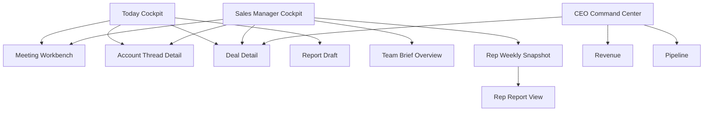
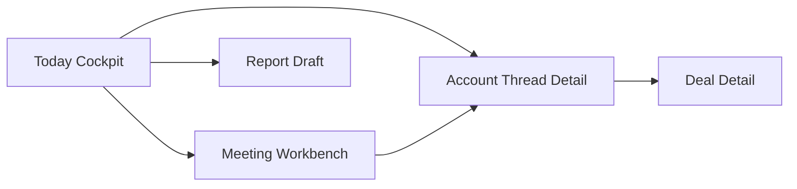
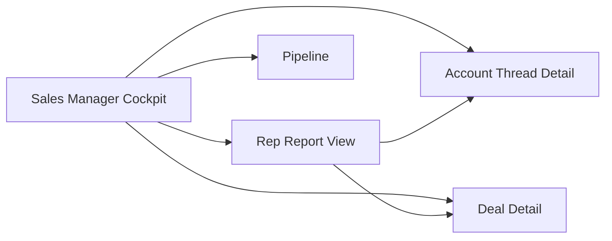
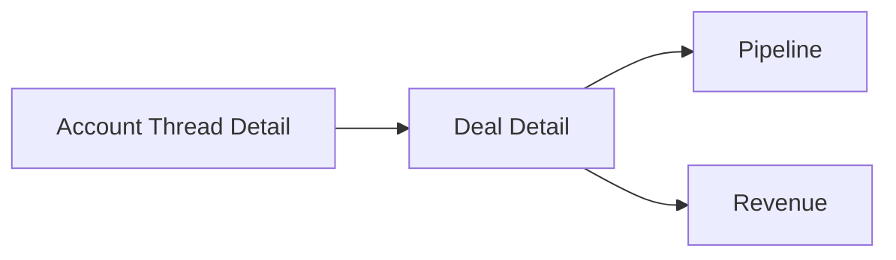

# Meeting-First Agent BP 前端设计稿说明

## 1. 文档定位

这份文档是最终产品设计之后的前端设计稿说明。

它不写接口，也不写实现代码。

它只回答前端设计层面的 6 个问题：

1. 这个产品在前端上应该给用户什么第一感受
2. 全局壳层和页面层级如何组织
3. 四个核心页面分别长什么样
4. 每个页面里 Agent 应该站在哪个位置说话
5. 汇报层如何进入一线销售和主管页面
6. 页面之间如何跳转和形成操作闭环

这份文档服务两个目标：

- 让产品、设计、前端对页面结构有共同理解
- 让后续开发不把页面做回 CRM 表单系统

---

## 2. 前端设计总原则

## 2.1 整体感受

这个产品的前端不应该给人“表单后台”或“报表系统”的感觉。

它更应该像：

**一个高压但清晰的销售作战室。**

用户进入系统后，最先感知到的不是数据，而是判断。

最先感知到的不是控件，而是优先级。

最先感知到的不是表格，而是 Agent 的一句话总结。

## 2.2 核心设计原则

### 原则一：先结论，后结构，再证据

每个核心页面都应该先告诉用户：

- 现在最重要的事情是什么
- 为什么重要
- 应该采取什么动作

然后才展示：

- 结构化状态
- 明细对象
- 证据路径

### 原则二：销售看行动，主管看总结，CEO 看经营判断

- 销售页面先展示“今天做什么”
- 主管页面先展示“团队里哪里要介入”
- CEO 页面先展示“收入哪里受影响” 

### 原则三：不让用户自己拼图

Meeting、客户线程、汇报、商机之间的关系，应该由系统主动串起来。

页面不能要求用户自己从 5 个表里拼出判断。

### 原则四：Agent 是主讲人，不是插件

Agent 不应该只存在于一个侧边聊天框里。

在核心页面，Agent 的自然语言判断必须进入页面主内容区。

### 原则五：所有状态变化必须可见

尤其是这几类状态必须显式显示：

- 建议
- 已确认
- 已应用
- 已同步
- 数据新鲜 / 过期 / 缺失

---

## 3. 前端总体结构

## 3.1 应用壳层

```text
+----------------------------------------------------------------------------------+
| Left Nav                     | Top Context Bar                                   |
+----------------------------------------------------------------------------------+
| Main Content Area                                                            |   |
|                                                                             | A |
|                                                                             | g |
|                                                                             | e |
|                                                                             | n |
|                                                                             | t |
|                                                                             |   |
|                                                                             | B |
|                                                                             | P |
+----------------------------------------------------------------------------------+
```

应用壳层固定由四部分组成：

1. 左侧主导航
2. 顶部上下文栏
3. 主内容区
4. 全局 Agent BP 面板

## 3.2 左侧导航建议

左侧导航保持稳定，不频繁变化。

建议顺序：

1. Home
2. Agent Workspace
3. Meetings
4. Customers
5. Deals
6. Pipeline
7. Sales Team
8. Revenue
9. Recaps
10. Data Sources
11. Settings

这里要注意：

- `Meetings` 和 `Customers` 在视觉上应比 `Deals` 更靠前
- 这不是弱化 Deal，而是明确 Meeting-first 的产品重心

## 3.3 顶部上下文栏

顶部栏统一承载：

- 搜索
- 时间范围
- 团队筛选
- 销售筛选
- 数据状态入口
- 通知入口
- Agent 打开入口

顶部栏不做复杂业务判断，只做跨页上下文切换。

## 3.4 全局 Agent BP 面板

右侧全局面板始终可用。

它有三种状态：

1. 收起
2. 打开并继承当前页面上下文
3. 打开并聚焦当前对象或当前指标

它在所有核心页面里都应该默认可被理解为：

**一个一直在旁边的销售 BP。**

---

## 4. 页面层级与角色关系

## 4.1 页面结构图



## 4.2 页面分组

### 一线销售主工作面

- Today Cockpit
- Meeting Workbench
- Account Thread Detail

### 主管主工作面

- Sales Manager Cockpit
- Team Brief Overview
- Rep Report View

### 经营视图层

- Deal Detail
- Pipeline
- Revenue

---

## 5. 视觉与信息层级方向

## 5.1 视觉风格

建议整体风格偏：

**冷静、紧张、作战室式、信息密度高但层次清晰。**

不要做成花哨的 CRM 仪表盘，也不要做成轻松的 consumer 产品。

## 5.2 页面视觉层级

每个核心页面都采用三层阅读顺序：

1. `Agent Brief Layer`
   一句话结论 + 两到三条原因 + 一个推荐动作

2. `Decision Layer`
   关键对象卡片、线程卡片、待确认卡片、汇报卡片

3. `Evidence Layer`
   录音、转录、截图、邮件片段、时间线、操作日志

## 5.3 模块密度建议

- Today Cockpit：高密度，但强调优先级和待办
- Meeting Workbench：中高密度，强调证据与确认
- Account Thread Detail：中密度，强调连续推进关系
- Manager Cockpit：高密度，强调聚合和下钻

## 5.4 颜色与状态语义

建议页面颜色只服务于状态，而不是装饰：

- 蓝色：Agent 判断、信息性动作
- 绿色：健康推进、已确认、可执行
- 黄色：待关注、待确认、中风险
- 红色：阻塞、高风险、缺失、停滞
- 灰色：未同步、草稿、系统背景态

---

## 6. 页面一：Today Cockpit

## 6.1 页面使命

Today Cockpit 的使命不是“展示我的所有客户”。

它的使命是：

**让销售在 30 秒内知道今天应该先做什么。**

## 6.2 页面阅读顺序

```text
第一眼：Agent 今日简报
第二眼：今日会议与待确认
第三眼：客户推进线程
第四眼：对主管汇报草稿
```

## 6.3 页面布局

```text
+----------------------------------------------------------------------------------+
| A. Agent 今日简报                                                                |
| 你今天先做这 3 件事                                                              |
| 原因 1 / 原因 2 / 原因 3                                                         |
| [查看第一件事] [继续追问]                                                        |
+--------------------------------------+-------------------------------------------+
| B. 今日会议流                         | C. 待确认区                               |
| - 待准备会议 3                        | - 会后总结待确认 2                         |
| - 已完成待处理 2                      | - 下一步动作待确认 3                       |
| - 今日关键 Meeting 1                  | - 待应用 2 / 待同步 1                      |
+--------------------------------------+-------------------------------------------+
| D. 客户推进线程列表                                                                  |
| - 客户 A：已建联 / 今天锁定下次会议                                              |
| - 客户 B：商机形成中 / 补预算负责人                                              |
| - 客户 C：商务推进中 / 阻塞在内部审批                                             |
+--------------------------------------+-------------------------------------------+
| E. 对主管汇报草稿                     | F. Agent 面板联动入口                      |
| - 今日草稿                            | - 为什么客户 B 还不能算正式商机           |
| - 本周草稿                            | - 帮我整理今日跟进                         |
+----------------------------------------------------------------------------------+
```

## 6.4 区块说明

### A. Agent 今日简报

这是第一优先级模块。

结构：

- 一句话结论
- 三条原因
- 三个快速动作按钮

目标：

- 不让销售先看列表再自己排序
- 直接把优先级说出来

### B. 今日会议流

这里是时间驱动区块。

建议按日程顺序展示：

- 待准备
- 今日进行中或刚结束
- 已结束但未完成会后动作

每条会议卡片都显示：

- 客户名
- Meeting 类型
- 会议时间
- 当前线程状态
- 需要做的下一步

### C. 待确认区

这是状态驱动区块。

它和会议流不同，它不是按时间，而是按“哪些事情卡在确认节点”组织。

这里应包括：

- 会后总结待确认
- 下一步动作待确认
- Deal 影响待确认
- CRM 同步待确认

### D. 客户推进线程列表

这是销售真正的客户工作面。

每一条都要展示两层状态：

- 客户进展
- 当前动作

并加上：

- 最近变化
- 当前阻点
- 下一步

### E. 对主管汇报草稿

这是新加的重要模块。

不应该放在角落里，但也不应压过销售当天执行。

建议放在主页面底部 1/4 区域。

它至少提供：

- 今日汇报草稿
- 本周汇报草稿
- 一键编辑
- 一键复制或发送占位

## 6.5 页面交互原则

- 用户从 Agent Brief 直接跳入 Meeting Workbench
- 用户从待确认区直接完成确认闭环
- 用户从线程列表直接进入 Account Thread Detail
- 用户从汇报草稿直接进入汇报编辑视图

---

## 7. 页面二：Meeting Workbench

## 7.1 页面使命

Meeting Workbench 是整套系统最重要的生产页面。

它的使命不是看纪要，而是：

**把一场 Meeting 转成判断、状态变化和行动。**

## 7.2 页面阅读顺序

```text
第一眼：这次 Meeting 改变了什么
第二眼：证据是否可信
第三眼：哪些内容要确认
第四眼：它影响了哪个线程和哪个 Deal
```

## 7.3 页面布局

```text
+----------------------------------------------------------------------------------+
| A. Header：客户 / 销售 / 时间 / 当前线程状态 / 数据状态                           |
+-----------------------------+--------------------------------+-------------------+
| B. 会前准备                 | C. 会议证据                    | D. Agent BP 判断   |
| - 客户背景                  | - 录音/转录                    | - 变化结论         |
| - 历史摘要                  | - 截图 / 邮件                  | - 原因             |
| - 会议目标                  | - 高亮片段                     | - 下一步           |
| - 建议问题                  | - 风险信号                     | - 待确认项         |
+-----------------------------+--------------------------------+-------------------+
| E. 会后总结与状态提议                                                              |
| - 总结候选                                                                        |
| - 客户进展变化提议                                                                |
| - 当前动作变化提议                                                                |
| - 是否形成正式商机                                                                 |
| - [确认] [修改] [驳回] [重跑]                                                     |
+----------------------------------------------------------------------------------+
| F. 影响范围：Account Thread | Deal 投影 | CRM 同步                                |
+----------------------------------------------------------------------------------+
```

## 7.4 区块说明

### A. Header

除了基础信息，必须显式展示：

- 当前客户线程状态
- 数据新鲜度
- 证据完整度

### B. 会前准备

这是为了让 Meeting 页面不只服务会后。

它也应该能服务会前准备场景。

内容包括：

- 客户背景
- 历史摘要
- 上次未解决问题
- 本次建议提问

### C. 会议证据

这是可信度核心区。

应优先展示：

- 录音和转录
- 高亮句子
- 风险信号片段
- 微信截图 OCR 片段
- 邮件片段

### D. Agent BP 判断

这是主判断区。

结构建议固定：

- 这次 Meeting 改变了什么
- 为什么重要
- 当前最建议动作是什么
- 需要人确认什么

### E. 会后总结与状态提议

这是页面的主操作区。

这里不只是总结，而是完整的“提议层”：

- Meeting 总结候选
- Account Thread 变化候选
- Next Step 候选
- Deal 形成/更新候选

### F. 影响范围区

这是最容易被做模糊的地方。

这里必须把影响范围切开：

- 影响客户线程
- 影响 Deal
- 是否同步 CRM

## 7.5 页面交互原则

- 页面必须支持“看证据再确认”
- 页面必须把“修改 / 驳回 / 重跑”放到主视野，不藏进菜单
- 页面必须把“Apply” 和 “Sync” 分开

---

## 8. 页面三：Account Thread Detail

## 8.1 页面使命

这个页面不是客户静态资料页。

它的使命是：

**让销售和主管看懂一条客户推进线程是如何连续变化的。**

## 8.2 页面阅读顺序

```text
第一眼：当前客户进展和当前动作
第二眼：最近 3 次 Meeting 改变了什么
第三眼：当前阻点和下一步
第四眼：是否已形成正式 Deal
```

## 8.3 页面布局

```text
+----------------------------------------------------------------------------------+
| A. Header：客户名称 / 当前进展 / 当前动作 / Owner / 数据状态                      |
+-----------------------------+--------------------------------+-------------------+
| B. 线程概览                 | C. 最近变化                    | D. Agent 建议      |
| - 当前进展                  | - 最近 3 次 Meeting            | - 当前风险         |
| - 当前动作                  | - 每次变化                     | - 下一步动作       |
| - 阻点                      | - 关键证据摘录                 | - 是否该升级 Deal  |
+-----------------------------+--------------------------------+-------------------+
| E. 推进时间线                                                                      |
| - Meeting 事件                                                                     |
| - 沟通事件                                                                         |
| - 状态变化事件                                                                     |
+----------------------------------------------------------------------------------+
| F. 正式商机投影区                                                                   |
| - 是否已有 Deal                                                                     |
| - Deal 当前状态                                                                      |
| - 与该线程的关系                                                                    |
+----------------------------------------------------------------------------------+
```

## 8.4 区块说明

### B. 线程概览

这里用一句话回答：

- 这家客户客观上推进到哪
- 现在销售应该干什么

### C. 最近变化

这是 Account Thread 页面最重要的中间区。

它必须把最近几次 Meeting 的变化串起来，而不是孤立列 Meeting。

### D. Agent 建议

Agent 在这里不是解释单次事件，而是解释连续趋势：

- 为什么这条线程在前进
- 为什么它停住了
- 为什么还不该升格为正式 Deal

### E. 推进时间线

这里的时间线不是“活动日志”。

它必须明确标出三类节点：

- 事实节点
- 判断节点
- 状态变化节点

## 8.5 页面交互原则

- 从时间线点击任何关键节点，应能跳到对应 Meeting 或证据
- 从 Agent 建议区，可直接生成下一步动作或会议 brief
- 从 Deal 投影区，可进入正式 Deal 页

---

## 9. 页面四：Sales Manager Cockpit + Team Brief

## 9.1 页面使命

这是主管真正的第一工作面。

它的使命不是让主管看全量数据，而是：

**让主管快速看懂团队推进结果，并知道自己应该介入哪里。**

## 9.2 页面阅读顺序

```text
第一眼：本周团队发生了什么
第二眼：哪里需要主管介入
第三眼：每位销售推进质量如何
第四眼：哪些对象值得下钻
```

## 9.3 页面布局

```text
+----------------------------------------------------------------------------------+
| A. Agent 主管简报                                                                |
| 本周团队最重要变化 + 3 个主管建议动作                                            |
+--------------------------------------+-------------------------------------------+
| B. Team Brief Overview               | C. Intervention Queue                     |
| - 触达客户数                         | - 需介入客户线程                          |
| - 完成 Meeting 数                    | - 需介入 Deal                             |
| - 新形成商机数                       | - 需辅导销售                              |
| - 推进中的商机数                     |                                           |
| - 停滞客户数                         |                                           |
+--------------------------------------+-------------------------------------------+
| D. Rep Weekly Snapshot 卡片列表                                                     |
| 每位销售：推进摘要 + 风险 + 新机会 + 需帮助项                                     |
+----------------------------------------------------------------------------------+
| E. Drilldown：高风险 Deal / 团队趋势 / Pipeline                                   |
+----------------------------------------------------------------------------------+
```

## 9.4 区块说明

### A. Agent 主管简报

这是主管首页的第一优先级。

结构固定：

- 一句话总结
- 三条原因
- 三条建议动作

### B. Team Brief Overview

这是新增的“汇报层主模块”。

它不是 KPI Row，而是主管对团队推进结果的第一摘要。

应分成两层：

- 第一层：自然语言摘要
- 第二层：极简结构化摘要

### C. Intervention Queue

这个模块把主管要介入的对象单列出来。

介入对象不止 Deal，也包括：

- 客户线程
- 某位销售
- 某个会后确认问题

### D. Rep Weekly Snapshot

这是主管理解团队推进质量的主列表。

每个卡片都要回答：

- 这个销售这周推进了什么
- 形成了哪些机会
- 哪个地方在卡住
- 我作为主管要不要介入

## 9.5 页面交互原则

- 主管应该能从 Team Brief 一步下钻到线程、Deal、Meeting
- 主管应该能从 Rep Snapshot 一步进入 Rep Report View
- 主管不应该先去全量列表里捞问题

---

## 10. Rep Report View 设计说明

## 10.1 页面定位

这是主管查看某个销售的周报视图。

它不需要成为一级主导航，但必须是清晰存在的下钻页面。

## 10.2 页面结构

```text
+----------------------------------------------------------------------------------+
| Header：销售名称 / 本周摘要 / 需要主管支持的 1 件事                               |
+--------------------------------------+-------------------------------------------+
| 本周结构化摘要                        | 本周关键变化                              |
| - 触达客户数                          | - 新形成商机                              |
| - 完成 Meeting 数                     | - 最大推进                                |
| - 新形成商机数                        | - 最大风险                                |
| - 停滞客户数                          | - 待主管支持                              |
+--------------------------------------+-------------------------------------------+
| 重点对象列表                                                                   |
| 客户 | 当前进展 | 本周变化 | 是否形成商机 | 风险 | 下一步 | 是否需主管        |
+----------------------------------------------------------------------------------+
```

## 10.3 页面作用

它解决的是主管对“单个销售”的深读问题。

不是看活动流水，而是看推进结果。

---

## 11. 页面之间的跳转关系

## 11.1 一线销售路径



## 11.2 主管路径



## 11.3 经营路径



---

## 12. 关键组件清单

为了让前端设计稳定，建议围绕以下组件组织页面：

- `AgentBriefHero`
- `MeetingQueueCard`
- `PendingConfirmCard`
- `ThreadSummaryCard`
- `ThreadTimeline`
- `MeetingEvidencePanel`
- `MeetingDecisionPanel`
- `ReportDraftCard`
- `TeamBriefCard`
- `InterventionQueueCard`
- `RepSnapshotCard`
- `RepReportTable`
- `DealProjectionCard`
- `DataFreshnessBadge`
- `ConfidenceBadge`
- `EvidenceDrawer`

这些组件不代表技术抽象已经定稿，但页面语义建议围绕它们组织。

---

## 13. 移动端和窄屏原则

## 13.1 桌面优先

这套产品首先服务桌面，因为它本质上是信息密度较高的工作台。

## 13.2 窄屏策略

在窄屏或笔记本上：

- Agent 面板可收起
- 三栏降为两栏
- 再降为单列
- 证据区与汇报区采用折叠面板

## 13.3 不应发生的事情

- 不要让 Agent 面板把主页面完全遮住
- 不要把 Today Cockpit 压缩成只有 KPI
- 不要让 Meeting Workbench 的证据区消失
- 不要让确认动作藏到二级菜单里

---

## 14. 最终前端设计结论

如果前端设计要不跑偏，建议最终固定以下 8 个页面设计原则：

1. 每个核心页面第一屏都必须先出现 Agent 判断
2. 一线销售首页先展示优先级，不先展示报表
3. Meeting 页面必须成为最核心的生产页面
4. Customer 页必须被重定义为 Account Thread 页
5. 主管首页必须显式包含 Team Brief 和 Intervention Queue
6. 汇报层必须同时存在于销售端和主管端
7. Deal 层只作为正式投影层，不反向定义销售工作流
8. 证据、确认、应用、同步必须始终在主视野中可见
